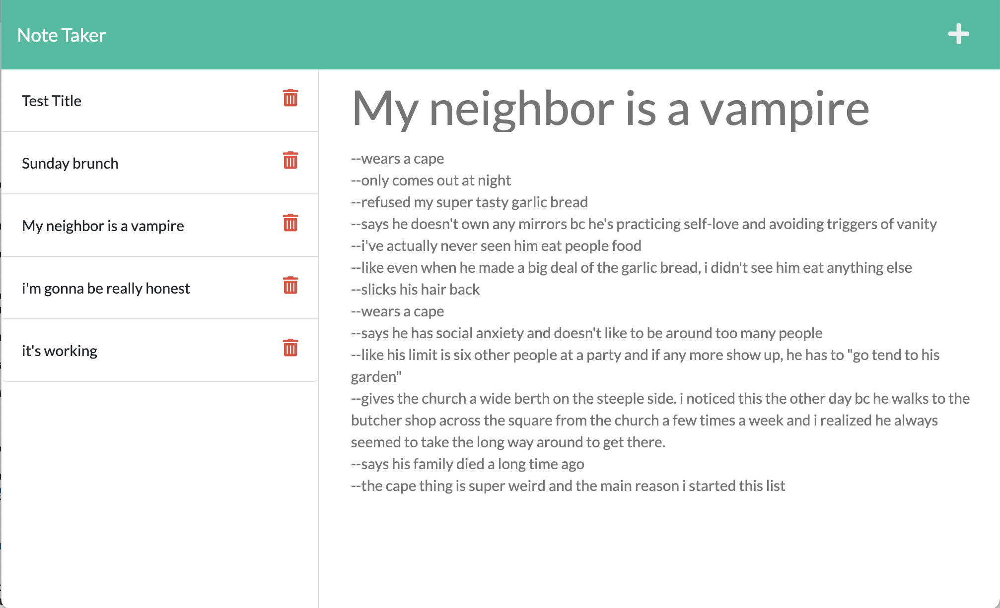

# Take-Notes


## Description: 
This app will allow you to write notes, save them locally, and delete them when they are no longer of use to you.
    
## Table of Contents:
[Project Information](#take-notes)<br />[Installation Instructions](#installation-instructions)<br />[Usage](#how-to-use)<br />[Preview](#preview)<br />[Website](#website)<br />[Credits](#credits)<br />[Collaborators](#collaborators)<br />[Tests](#testing)<br />[Questions](#questions)<br />[License](#license)<br />[Made By](#made-by)

## Built With the Following:
- JavaScript
- HTML
- CSS
- ES6
- Bootstrap
- Node

## Installation Instructions:
- Download and install Node_js onto your computer.
 - Use the package manager Express:
```npm install express```
 - Clone this repository or download the project's zip file--be sure to uncompress it.
 - Navigate to this folder from the Command Line.
 - Run ```node server.js```.

## How to Use:
Your Command Line should inform you that you've initiated the server on PORT 3001. Open your preferred web browser and navigate to [localhost:3001](http://localhost:3001). From here, click the "Get Started" button and you'll be directed to your very own, locally-hosted, note-taking web app. 

Click the plus-sign on the top-right of the screen to add a new note, then save it by clicking on the floppy disk that appears next to it while you're writing. It will appear on the left-hand side-bar by its title name. Click on the title to read the note's contents. You'll also notice a trash can icon to the right of its title in the side-bar; click on it when you're ready to delete your note.
    
## Preview:

    
## Website:
[See the app live on Heroku!](https://secure-cliffs-34490.herokuapp.com)

## Credits:
- UUIDv4 
- Express.js 
- Jest.js

## Collaborators:
Starter code provided by The Coding Bootcamp at UT-Austin.

## Testing:
- Install Jest.js by entering ```npm install jest``` in the Command Line. You may need to modify the package.json file so that it runs in this way: 
```
    "scripts": {
        "test": "jest",
        "start": "node server.js"
    }
  ```
 
- In the Command Line, type ```npm test``` to run tests for the app's ```writeNewNote```, ```findNoteById```, ```validateNote```, and ```deleteNote``` functions.

## Github: 
[https://github.com/itsmeadriana](https://github.com/itsmeadriana)


## License
[Click here for more information.](https://choosealicense.com/licenses/mit/)

### Made By
© Copyright 2021 Adriana Nieves
